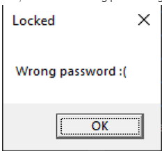
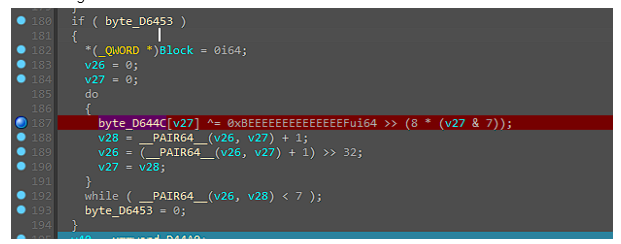
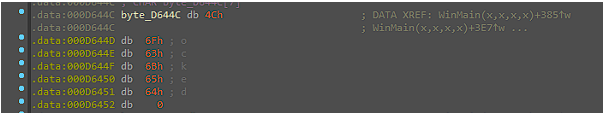
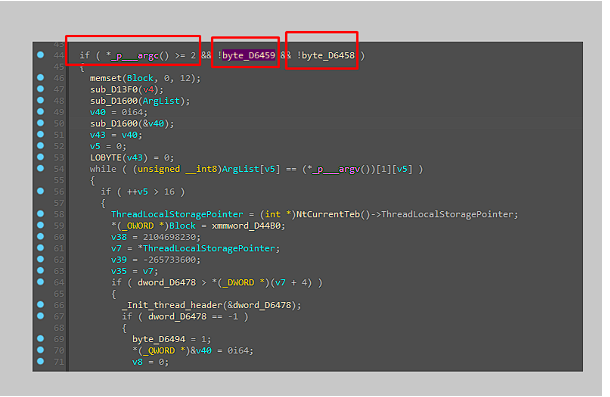
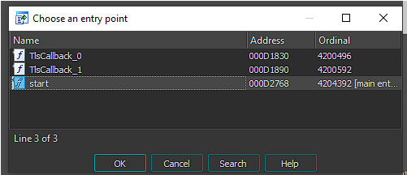
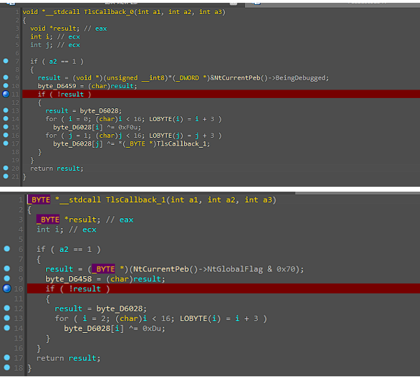
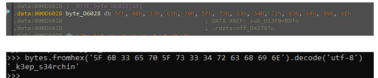
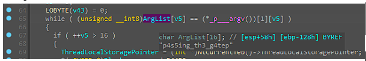
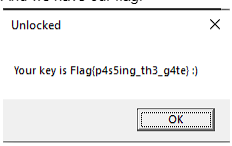

# Final Gate 

## TLDR:

1. Bypass the anti-debugging validation
2. Verify what arguments were needed

## Introduction:

We received one EXE file with the hash (8d665653f572b550400313feb208b277604805803182b15868daeafc80eb40ae).

When executing it the first time, it pop’s up a Message Box with the Title “Locked”. So now, we have a starting point during our analysis.

If we load our program with IDA, we will see that we don’t see any of these strings. During execution, we can see that it will perform XOR operations that will lead us to those strings.

So now we know that any XOR operation on this EXE could lead us to the flag.

We have one interesting IF statement, before anything is XORified. 

According to microsoft, https://learn.microsoft.com/en-us/cpp/c-runtime-library/argc-argv-wargv?view=msvc-170, we know that “___argc” is our arguments counter. We also know that always the first argument holds the program name and the second points to the first actual argument. We know now, we will have to send at least one argument to the execution.

The next bytes shown after the argument counter, are related to the TLS callback.
According to the IDA documentation, if you press CONTROL+E you can choose the application entry points. We can see that our application has two TLS callbacks.

I won’t go into the details about TLS(Thread-Local-Storage), however all we need to know is that they are executed before our program entry point. And if we take a look at both TLS callbacks, we can see that they are being used to verify if the application is being debugged.

So now, I thought of three options.
1. Use x32dbg to patch these flows then use IDA. (didn’t test)
2. Manually modify the registers using IDA
3. Use x32dbg with ScyllaHide since it is able to bypass Process Environment Block

2. 
After updating the registers manually we see that we get a string. We can try to send this as a parameter. We have to update the anti-debug stuff, again.

During the execution

“p4s5ing_th3_g4te” has the 16 chars that we want. If we pass this as our argument, it finally enters the while loop and proceeds to the if statement.

And we have our flag.

Reminder:

3. When using x32dbg, you have to be careful since with the default settings it breaks on TLSCallbacks. And due to this, the bytes of the function are going to be different due to int3 interruption.

As shown here:

As you can see, the dl is going to be “CC”. Why? Because the setting “Break on: TLS Callbacks*" in the Preferences on x32dbg is on. Then the debugger does the following:

The debugger is basically replacing the first byte with an int3 instruction. That’s the reason why it ends up with “CC”. 

You can replicate the same behavior if you place a breakpoint on the first byte “F8”. So you have to be careful with this.
